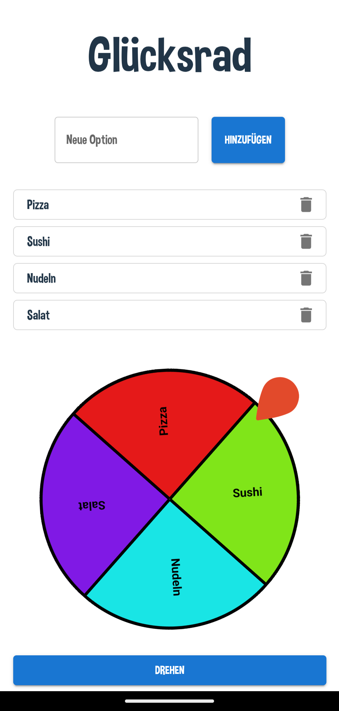

# Glücksrad - A React PWA

Welcome to **Lucky Wheel**, an interactive spinning wheel application built with **React, Vite, Material UI, and TypeScript**. This project is also a **Progressive Web App (PWA)** that supports offline usage and updates automatically when a new version is available.

## 🚀 Features

- 🎨 **Dynamic Wheel**: Users can add and remove options to customize their wheel.
- ⚡ **PWA Support**: Install the app on your device and use it offline.

## 📸 Screenshots



## 🛠️ Installation & Setup

### 1️⃣ Clone the repository

```sh
git clone https://github.com/your-username/lucky-wheel.git
cd lucky-wheel
```

### 2️⃣ Install dependencies

```sh
npm install
```

### 3️⃣ Run the development server

```sh
npm run dev
```

### 4️⃣ Build for production

```sh
npm run build
```

### 5️⃣ Preview the production build

```sh
npm run preview
```

## 📦 PWA Installation

The application supports **Progressive Web App (PWA)** features. To install:

- **On Desktop**: Click the install button in the browser's address bar.
- **On Mobile**: Open in a browser (Chrome/Safari) → Tap "Add to Home Screen".

## 📜 License

This project is licensed under **CC0 1.0**.

## 📬 Contact

For any questions or suggestions open an issue.
